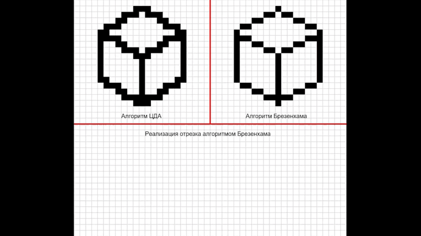

# Java Rasterization Project

This project implements a simple rasterization application using JavaFX. The application allows users to draw lines on a pixel grid using two different line-drawing algorithms: DDA (Digital Differential Analyzer) and Bresenham's algorithm. The user can interactively click on the canvas to draw lines between two points.

## Features

- Interactive pixel grid for drawing
- Implementation of DDA and Bresenham's line-drawing algorithms
- Visual representation of the algorithms' outputs

## Requirements

- Java Development Kit (JDK) 11 or higher
- JavaFX SDK

## Demo

